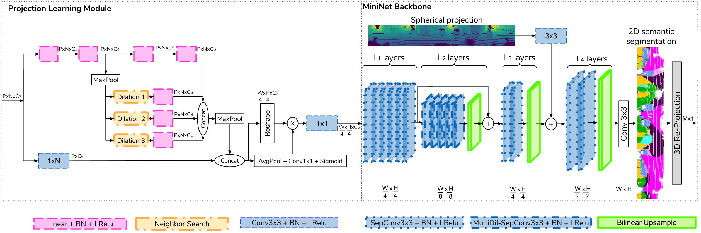

<div align="center">  

# 3D-MiniNet: Learning a 2D Representation from Point Clouds for Fast and Efficient 3D LIDAR Semantic Segmentation


[](https://paperswithcode.com/sota/3d-semantic-segmentation-on-semantickitti?p=3d-mininet-learning-a-2d-representation-from)

[](https://paperswithcode.com/sota/real-time-3d-semantic-segmentation-on?p=3d-mininet-learning-a-2d-representation-from)

[](https://arxiv.org/pdf/2002.10893.pdf)

</div>


## Introduction
This repository contains the implementation of **3D-MiniNet**, a fast and efficient method for semantic segmentation of LIDAR point clouds.

The following figure shows the basic building block of our **3D-MiniNet**:

<p align="center">  </p>


3D-MiniNet overview. It takes *P* groups of *N* points each and computes semantic segmentation of the *M* points of the point cloud where *PxN=M*.

It consists of two main modules: our proposed learning module (on the left) which learns a 2D tensor which is fed to the second module, an efficient FCNN backbone (on the right) which computes the 2D semantic segmentation. Each 3D point of the point cloud is given a semantic label based on the 2D segmentation.

## Code (Pytorch and Tensorflow implementation)    

Our [PyTorch code](pytorch_code/lidar-bonnetal/train/tasks/semantic/) is based on [Milioto et al. code](https://github.com/PRBonn/lidar-bonnetal) and the [Tensorflow code](tensorflow_code) is based on [Biasutti et al. code](https://github.com/pbias/lunet).  For copyright license, please check both code base licenses. 

We took their code base and integrate our approach. Therefore, please, consider also citing or checking their work.


## Citation 

If you find 3D-MiniNet useful, please consider citing:

```
@article{alonso2020MiniNet3D,
  title={3D-MiniNet: Learning a 2D Representation from Point Clouds for Fast and Efficient 3D LIDAR Semantic Segmentation},
  author={Alonso, I{\~n}igo and Riazuelo, Luis and Montesano, Luis and Murillo, Ana C},
booktitle={IEEE/RSJ International Conference on Intelligent Robots and Systems (IROS)},
  year={2020},
  organization={IEEE}
}
```
